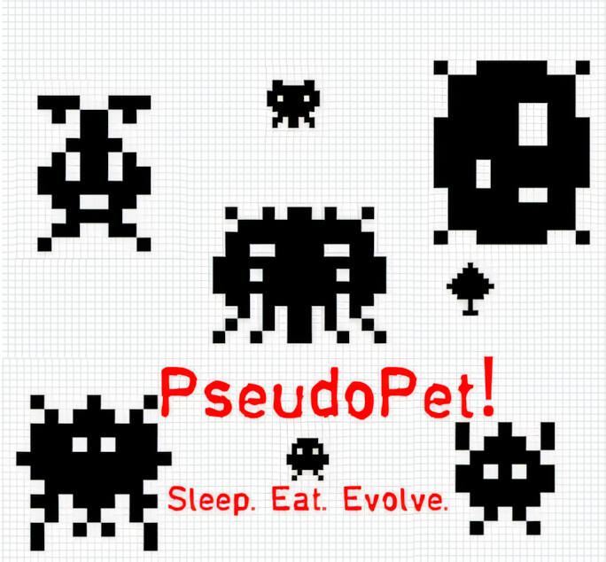
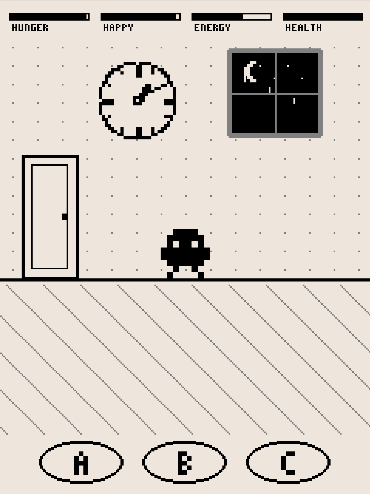
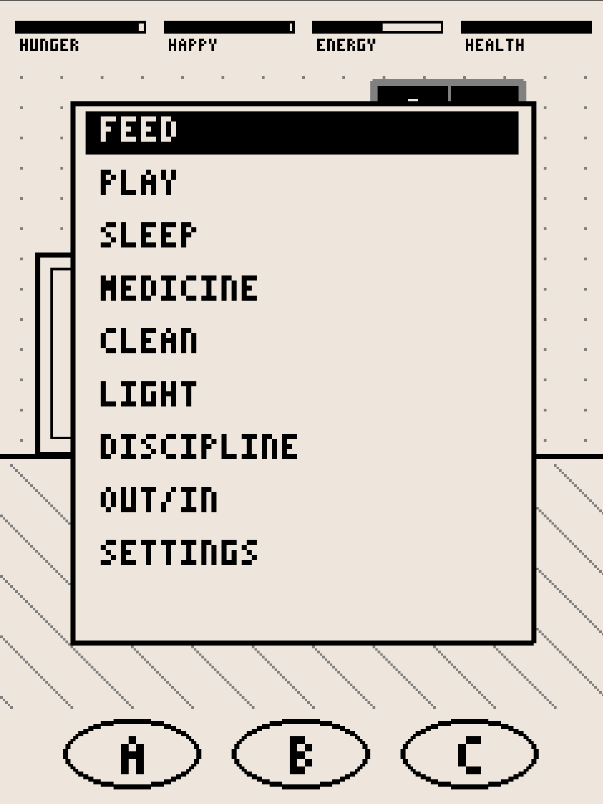
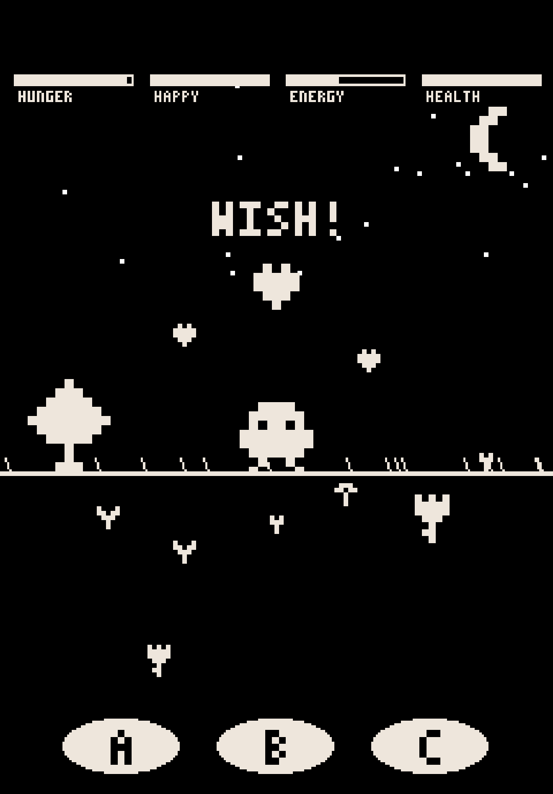
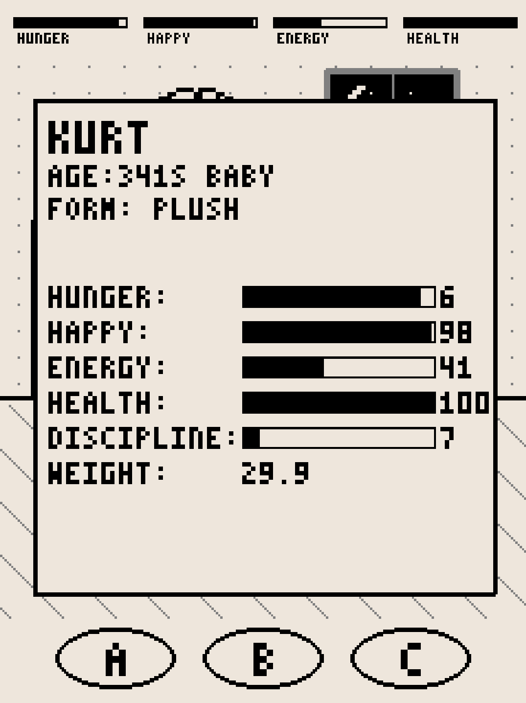

# PseudoPet 🐾

<p align="center">

</p>

<p align="center">
<i>Eat. Sleep. Evolve!</i>
</p>

---

A retro-style Tamagotchi clone built with Python and Pygame. Designed to run on Desktop and be portable to Android via Buildozer.

## ✨ Features

- **Core Gameplay**: Feed, play, and care for your digital pet.
- **Mini-Games**: 
  - 🍎 **Snack**: Quick reaction game.
  - 🛡️ **Defense**: Protect your pet.
  - 🎾 **Pong**: Classic arcade fun.
  - 🎣 **Fishing**: Relaxing mini-game.
- **Evolution & Growth**: Watch your pet grow and change.
- **Retro Aesthetics**: Pixel-art style with custom fonts and sound effects.
- **Cross-Platform**: Optimized for Linux/Windows/macOS and Android.

## 📸 Screenshots

| | |
| :---: | :---: |
|  |  |
|  |  |

## 🚀 Quickstart (Linux/macOS)

The fastest way to get running:

```bash
git clone https://github.com/zahnschmelz/pseudopet_dev.git
cd pseudopet_dev
chmod +x run.sh
./run.sh
```
*Note: `run.sh` automatically handles virtual environment creation and dependency installation. (Tested on Linux, macOS compatibility not guaranteed).*

## 🛠️ Tech Stack

- **Language**: Python 3.x
- **Engine**: [Pygame](https://www.pygame.org/)
- **Deployment**: [Buildozer](https://buildozer.readthedocs.io/) (for Android)
- **Dependencies**: `pygame`, `websockets`, `kivy`, `plyer`, `pyjnius`

## ⚙️ Manual Setup (Advanced)

If you want to manage your own environment:

1. **Set up a virtual environment**:
   ```bash
   python3 -m venv venv
   source venv/bin/activate
   ```

2. **Install dependencies**:
   ```bash
   pip install -r requirements.txt
   ```

3. **Run the app**:
   ```bash
   python main.py
   ```

### Building for Android

To build an APK, you will need `buildozer` and a Linux environment (or WSL).

1. **Install Buildozer**:
   ```bash
   pip install buildozer
   ```

2. **Build the APK**:
   ```bash
   bash build_apk.sh
   ```

## 📁 Project Structure

- `main.py`: The main entry point.
- `config.py`: Game configurations and settings.
- `src/`: Core logic and package modules.
- `buildozer.spec`: Build configuration for Android.

## 🔊 Credits

### Sound Effects
A mix of original recordings and assets from [Freesound.org](https://freesound.org/) and [Pixabay](https://pixabay.com/).

**Attribution Required (CC BY 4.0):**
- `Poop.wav`: [JuanFG](https://freesound.org/people/JuanFG/)
- `cough9.aiff`: [Fratz](https://freesound.org/people/Fratz/)
- `handclapper...`: [jerry.berumen](https://freesound.org/people/jerry.berumen/)

**CC0 & Pixabay License (No Attribution Required):**
- **Background Music**: [noel.wav](https://freesound.org/people/noel.wav/) (Lo-Fi Morning Breeze - 8-bitified version)
- **SFX**: 
  - `Police Whistle`: [Horror_House_Music](https://pixabay.com/)
  - `Egg cracking`: [FngerSounds](https://pixabay.com/)
  - `Pills Container`: [Lesiakower](https://pixabay.com/)
  - `KISS KISS`: [british33](https://freesound.org/people/british33/)
  - `Clap at Two Church`: [jonsept](https://freesound.org/people/jonsept/)
  - `sneeze`: [starplatinums](https://freesound.org/people/starplatinums/)
  - `wet fart`: [kuchtaa](https://pixabay.com/)
  - `Motorcycle Pass By`: [Universfield](https://pixabay.com/)
  - `Level Up`: [KoiRoylers](https://pixabay.com/)
  - `chicken`: [digitalstore07](https://pixabay.com/)

## 📜 License

This project is licensed under the **MIT License**. See the [LICENSE](LICENSE) file for details.
